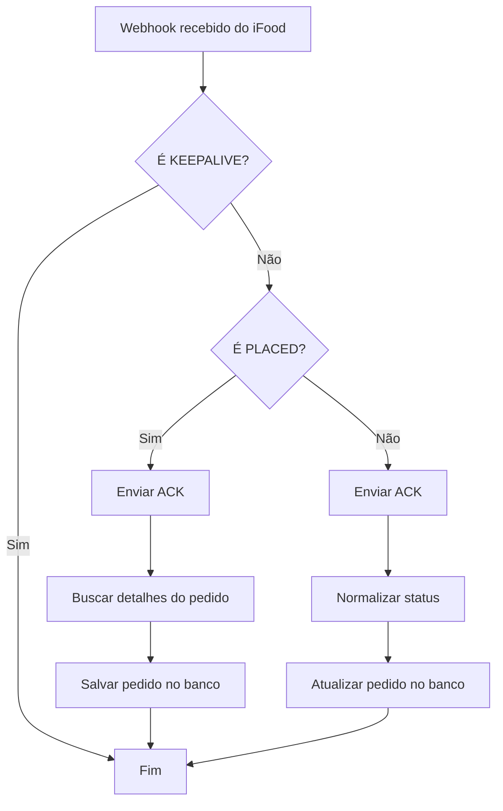
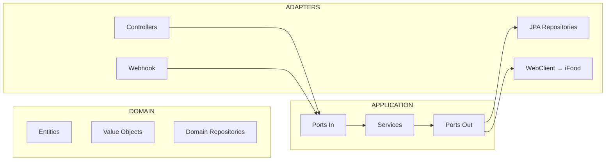
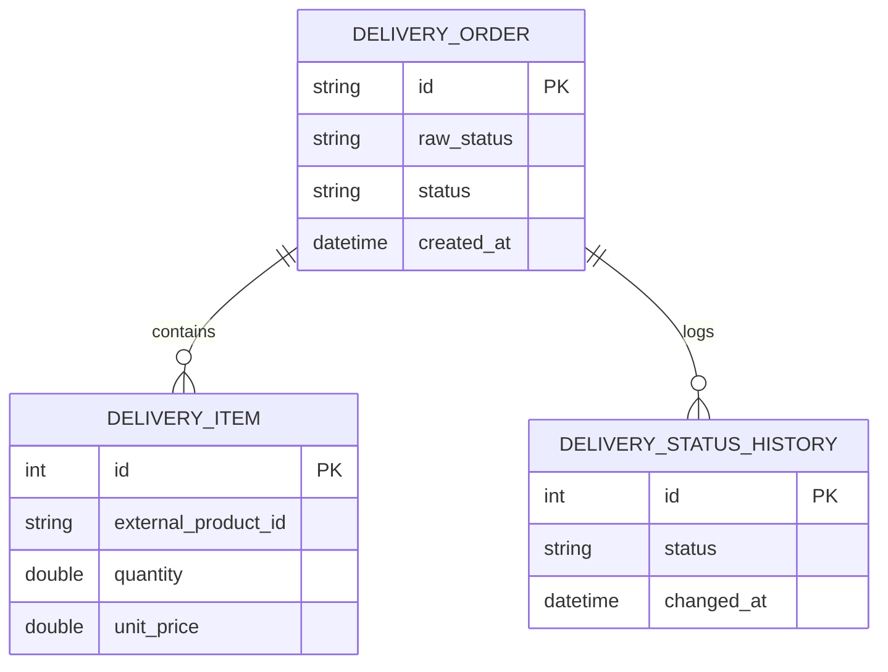

# Sistema de Gerenciamento de Restaurante com Integração iFood

> **TCC – Desenvolvimento de Sistema Fullstack com Arquitetura Hexagonal, DDD e Integração com Webhooks do iFood**
>
> *Tecnologias: Spring Boot (Java 17), Maven, Docker, MySQL, WebClient, Resilience4j, Flyway, JPA/Hibernate, MapStruct*

---

## 📌 Visão Geral do Projeto
Este projeto consiste no desenvolvimento de um **sistema completo de gerenciamento de restaurante**, abrangendo:

- **Cadastro de produtos, fornecedores e cardápios**
- **Gestão de comandas e pedidos internos**
- **Integração nativa com o iFood via Webhooks**
- **Processamento automático do fluxo de pedidos de delivery**
- **Arquitetura Hexagonal (Ports & Adapters)**
- **DDD (Domain-Driven Design)**
- **Banco de dados persistido com MySQL + Flyway**

Na **versão 1 (V1)**, o sistema recebe notificações do iFood, salva o pedido e atualiza automaticamente seu status.

A **versão 2 (V2)** prevê telas para a cozinha atualizar o status manualmente (ex: Em preparação → Pronto → Saiu para entrega).

---

# 🧱 Arquitetura do Sistema

A solução é desenvolvida seguindo padrões modernos de arquitetura:

### ✔ Arquitetura Hexagonal (Ports & Adapters)
### ✔ DDD: Entities, Value Objects, Aggregates
### ✔ Clean Architecture
### ✔ Separação clara entre domínio, aplicação e infraestrutura

---

# 📂 Estrutura de Pastas (Explicação Completa)
A árvore completa está explicada **arquivo por arquivo**, com foco na arquitetura hexagonal.

## **1. Camada Domain (Regra de Negócio)**
Local: `src/main/java/com/gerencia_restaurante/domain`

Onde fica **toda a lógica essencial que não depende de frameworks**.

### **1.1 domain/delivery**
- `DeliveryOrder` – Entidade raiz do agregado de pedidos iFood
- `DeliveryItem` – Itens do pedido
- `DeliveryCustomer` – Cliente informado pelo iFood
- `DeliveryAddress` – Endereço da entrega
- `DeliveryStatusHistory` – Histórico de mudanças de status
- `DeliveryOrderStatus` – Enum do fluxo interno de estados (State Machine)

### **1.2 domain/entity**
Entidades internas do restaurante:
- `Produto`
- `Fornecedor`
- `Cardapio`
- `PedidoComanda`
- `ItemPedido`

### **1.3 domain/repository**
Interfaces de repositório para o domínio.

### **1.4 domain/valueobject**
Value Objects caso o domínio precise.

---

## **2. Camada Application (Casos de Uso)**
Local: `src/main/java/com/gerencia_restaurante/application`

Essa camada **contém regras de orquestração**, mas nunca acessa banco ou frameworks diretamente.

### **2.1 application/delivery**
- `DeliveryOrderService` – Casos de uso internos
- `DeliveryWebhookProcessor` – Processamento de eventos do iFood (integração)
- `IfoodAuthService` – Autenticação OAuth com o iFood
- `IfoodOrderClient` – Comunicação HTTP com o iFood (WebClient)

### **2.2 application/mapper**
Conversores automáticos do MapStruct.

### **2.3 application/port/in**
Interfaces de entrada para casos de uso:
- `CadastrarProduto`, `AtualizarCardapio`, etc

### **2.4 application/port/out**
Interfaces de saída (Gateways):
- Estruturas para retorno de comandas

### **2.5 application/dto**
Objetos de transferência que a aplicação expõe.

---

## **3. Camada Adapters (Interface com mundo externo)**
Local: `src/main/java/com/gerencia_restaurante/adapters`

### **3.1 inbound (Entrada)**
- `DeliveryOrderController` – Endpoints REST internos
- `IfoodWebhookController` – Recebimento de Webhooks do iFood
- `GlobalExceptionHandler` – Conversão de erros em respostas HTTP

### **3.2 outbound (Saída)**
#### Persistence:
Repositórios JPA:
- `DeliveryOrderRepository`
- `DeliveryItemRepository`
- `DeliveryStatusHistoryRepository`

#### External API (iFood):
- `IfoodOrderDetailsDto` – estrutura de dados recebidos

### **3.3 web**
Controladores internos (não relacionados ao delivery):
- Produtos
- Comandas
- Cardápios
- Fornecedores

---

## **4. Infrastructure**
Local: `src/main/java/com/gerencia_restaurante/infrastructure`

Configurações globais:
- `WebClientConfig`

---

# 🧩 Fluxo Completo do Pedido iFood (Webhook + ACK + Persistência)

## 📌 **1. iFood envia Webhook**
Evento chega em:
```
POST /webhooks/ifood
```

Exemplo:
```json
{
  "id": "abc123",
  "code": "PLC",
  "fullCode": "PLACED",
  "orderId": "UUID-do-pedido"
}
```

---

## 📌 **2. Sistema envia ACK imediato**
Obrigatório pelo iFood:
```
POST /order/v1.0/events/acknowledgment
```

---

## 📌 **3. Se for PLACED → sistema consulta detalhes do pedido**
```
GET /order/v1.0/orders/{orderId}
```
E salva o pedido completo.

---

## 📌 **4. Se for outro evento → atualiza status**
Ex:
- PREPARATION_STARTED → IN_PREPARATION
- READY_TO_PICKUP → READY
- DISPATCHED → DISPATCHED
- CONCLUDED → CONCLUDED (força aceitação mesmo fora da ordem)

---

# 📘 Fluxograma Geral da Integração iFood



---

# 📐 Diagrama: Arquitetura Hexagonal



---

# 🧮 Modelo de Dados (ER) Simplificado



---

# 🐳 Como Rodar com Docker

### **1. Build do projeto**
```
mvn clean package -DskipTests
```

### **2. Subir ambiente**
```
docker-compose up --build
```

A aplicação subirá em:
```
http://localhost:8080
```
Banco de dados MySQL:
```
localhost:3306
user: root
password: root
```

---

# 💻 Como Rodar Localmente (sem Docker)

### **Pré requisitos:**
- Java 17
- Maven
- MySQL rodando localmente

### **Rodar:**
```
mvn spring-boot:run
```

---

# 📮 Integração com API de CEP (ViaCEP)

O sistema também integra com a API pública **ViaCEP**, permitindo consultar e atualizar automaticamente o endereço do fornecedor a partir do CEP.

A integração segue a Arquitetura Hexagonal:
- **Adapter Outbound:** `ViaCepClient` (consulta a API externa)
- **DTO externo:** `ViaCepResponse`
- **Application Service:** `CepLookupService`
- **Controller:** novos endpoints no `FornecedorController`
- **Domain:** atualização automática do atributo `endereco` da entidade `Fornecedor`

### 📌 Fluxo da integração
1. Usuário chama o endpoint informando um CEP.
2. `ViaCepClient` consulta `https://viacep.com.br/ws/{cep}/json/`.
3. `CepLookupService` monta o endereço completo.
4. O serviço retorna o endereço ou atualiza o fornecedor.

### 🧾 Exemplo de retorno ViaCEP
```json
{
  "cep": "01001-000",
  "logradouro": "Praça da Sé",
  "bairro": "Sé",
  "localidade": "São Paulo",
  "uf": "SP"
}
```

### 🧱 Endpoints implementados

#### ✔ Consultar endereço por CEP (não salva)
```
GET /fornecedor/cep/{cep}
```

#### ✔ Atualizar endereço do fornecedor via CEP
```
PATCH /fornecedor/{id}/cep/{cep}
```

---

# 📚 Endpoints Importantes

## **🌐 Webhooks iFood**
```
POST /webhooks/ifood
```

## **📦 CRUD interno de pedidos delivery**
```
GET /api/delivery/orders
GET /api/delivery/orders/{id}
GET /api/delivery/orders/status/{status}
PATCH /api/delivery/orders/{id}/status?status=READY_TO_PICKUP
```

## **📦 CRUD produtos**
```
GET /produtos
POST /produtos
```

---

# 📖 Para a banca: Por que este projeto é destaque?

✔ Arquitetura moderna (Hexagonal + DDD)  
✔ Integração real com API oficial do iFood  
✔ Robusto contra falhas de ordem de eventos  
✔ Log completo de histórico  
✔ Webhooks assíncronos com ACK obrigatório  
✔ Persistência com versionamento (Flyway)  
✔ Divisão perfeita entre camadas  
✔ Sistema modular com agregados independentes (Cardápio, Produto, Fornecedor)

---

# 🏁 Conclusão
Este projeto demonstra domínio completo de:
- Arquitetura corporativa
- Boas práticas avançadas de desenvolvimento
- Integrações reais com serviços externos
- Modelagem de domínio complexa
- Documentação profissional

